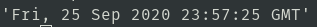

# Web Scraping


## requests: solicitudes web (get,post,put,delete,patch,options)
> [**Click aquí: https//pypi.org**](https://pypi.org/project/requests/)

* Instalación
	```
	$ pip3 install requests
	```
* aplicando a la pagina de: hackspace
	```py
	import requests
	response=requests.get('https://www.hackspace.pe/')
	response
	```
	
	```py
	dir(response)
	```
	
	```py
	response.status_code
	```
	
	```py
	response.headers
	```
	
	```py
	response.headers['Date']
	```
	
	```py
	response.text
	```
	
## beautifulsoup4: webscraping
> [**Click aquí: https://pypi.org/project/beautifulsoup4**](https://pypi.org/project/beautifulsoup4/)

* instalación
	```
	$ pip3 install beautifulsoup4
	```
* links respecto a determinada clase
	```py
	import requests
	response=requests.get('https://www.hackspace.pe/')
	import bs4
	soup = bs4.BeautifulSoup(response.text,'html.parser')
	links = soup.select('.description a')
	courses = [course['href'] for course in links]
	for course in courses:
	print(course)
	```
	
* extraer precio de un producto de la tienda wong
	```py
	import requests
	response=requests.get('https://www.wong.pe/fiddler-cooler-para-laptop-15-785296/p')
	import bs4
	soup = bs4.BeautifulSoup(response.text,'html.parser')
	links = soup.select('.skuBestPrice')
	```
	
