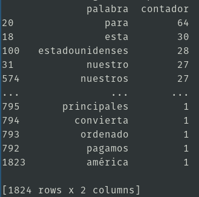

# beautifulsoup4: webscraping
> [**Click aquí para ir a la documentacion oficial**](https://pypi.org/project/beautifulsoup4 "dale click papu")

## instalación
```
$ pip3 install beautifulsoup4
```
## Contar palabras de un discurso
1. `codigo.py`
	```py
	import urllib.request
	from bs4 import BeautifulSoup
	url = 'https://elpais.com/internacional/2018/01/31/actualidad/1517387619_036241.html'
	html = urllib.request.urlopen(url)
	soup2 = BeautifulSoup(html)
	tags = soup2('p')
	discurso = ''
	for tag in tags:
	    if(len(tag.attrs)) == 0:
		a = tag.contents[0]
		discurso = discurso + a

	print(discurso)
	contadores = dict()
	discurso = discurso.replace(',','').replace('.','').replace('?','').lower()
	palabras = discurso.split()
	for palabra in palabras:
	    if len(palabra) > 3:
		contadores[palabra] = contadores.get(palabra,0) + 1

	import pandas
	b=pandas.DataFrame(list(contadores.items()),columns=['palabra','contador']).sort_values('contador',ascending=False)
	print(b)

	```
2. output  
	1. discurso   
		
	2. conteo de palabras  
		
## Fondo de inversion
1. `codigo`

	```py
	import urllib.request
	from bs4 import BeautifulSoup
	participaciones = 50
	url = 'http://www.morningstarfunds.ie/ie/funds/snapshot/snapshot.aspx?id=F00000PJME'
	html = urllib.request.urlopen(url)
	soup = BeautifulSoup(html)
	tags = soup.find_all("td",class_="line text")
	valor = tags[0]
	valor = float(valor.contents[0].replace('EUR\xa0',''))
	total = participaciones*valor
	print(total)
	```
2. output: 697.5
