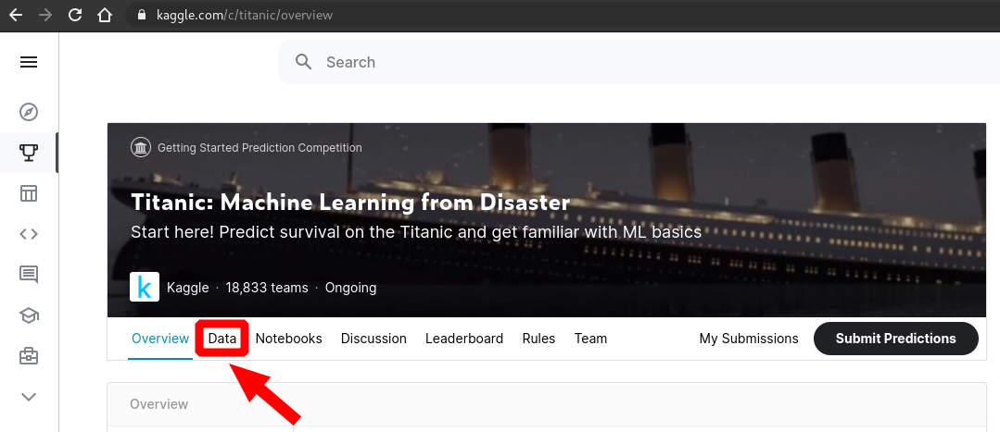
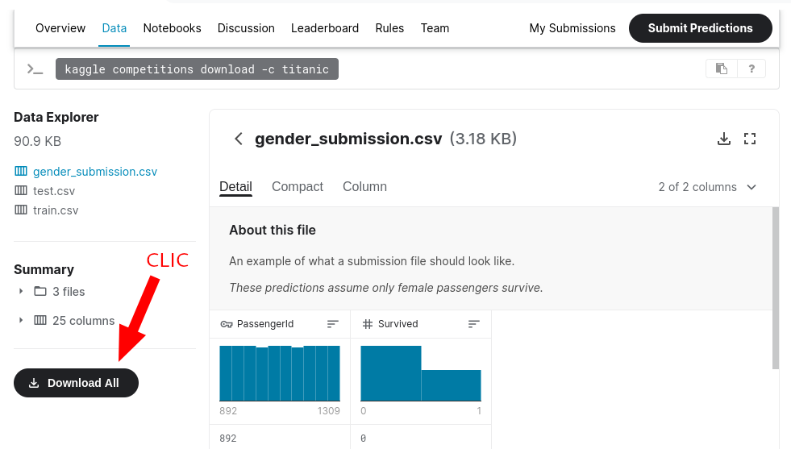
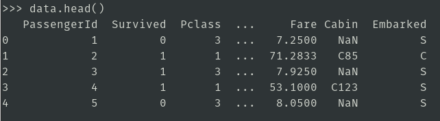
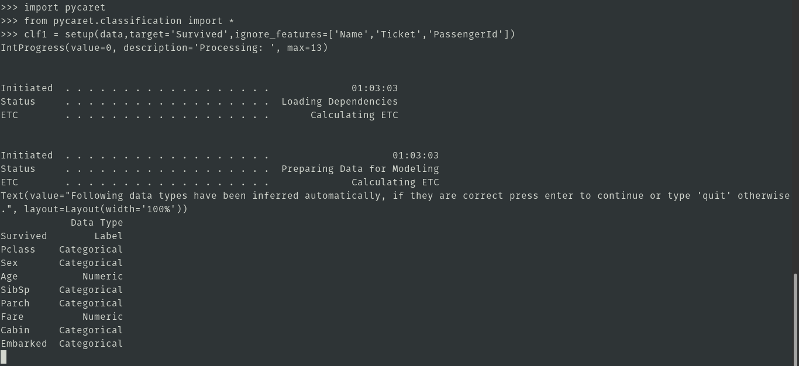
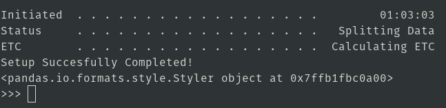

# Titanic: Machine Learning from Disaster
**Start here! Predict survival on the Titanic and get familiar with ML basics**    

## Instalación
```
$ pip3 install pycaret
```

## Descargamos
1. Entramos a: **https://www.kaggle.com/c/titanic**  
	  
2. Descargamos  
	  
3. Descomprimos  
	```
	$ unzip titanic.zip
	```
4. Tendremos la carpeta "titanic" que contiene:
	```
	titanic
	├── gender_submission.csv
	├── test.csv
	└── train.csv
	```
## Ejecución
> [**Clic aquí para ver un video guía**](https://www.youtube.com/watch?v=nqMM6rngNCA)

1. **STEP 1: Setup the environment**
	1. Iniciamos python
		```
		$ python
		```
	2. Vemos las primeras líneas de: `train.csv`
		```py
		import pandas as pd
		data = pd.read_csv('titanic/train.csv')
		data.head()
		```
		
	3. Ejecutamos
		```py
		import pycaret
		from pycaret.classification import *
		clf1 = setup(data,target='Survived',ignore_features=['Name','Ticket','PassengerId'])
		```
	4. Verificamos el Data Types y presionamos: Enter  
		
	5. Finalmente nos sale  
		
2. **STEP 2: Compare Models**  
Compare models train all models in library and evaluate metrics on K-Fold cross validation  
	```py
	compare_models()
	```
3. **STEP 3: tunning best performing models**
	```py
 	tuned_lightgbm = tune_model('lightgbm',optimize='AUC')
	```
4. **STEP 4: evaluate trained model**
	```py
	evalutate_model(tuned_lightgbm)
	```
5. **STEP 5: predict test data**  
Finalize model fits the model on entire dataset  
	```py
	final_lightgbm = finalize_model(tuned_lightgbm)
	print(final_lightgbm)
	test = pd.read_csv('titanic.test.csv')
	test.head()
	predictions = predict_model(final_lightgbm,data=test)
	predictions.head()
	```
